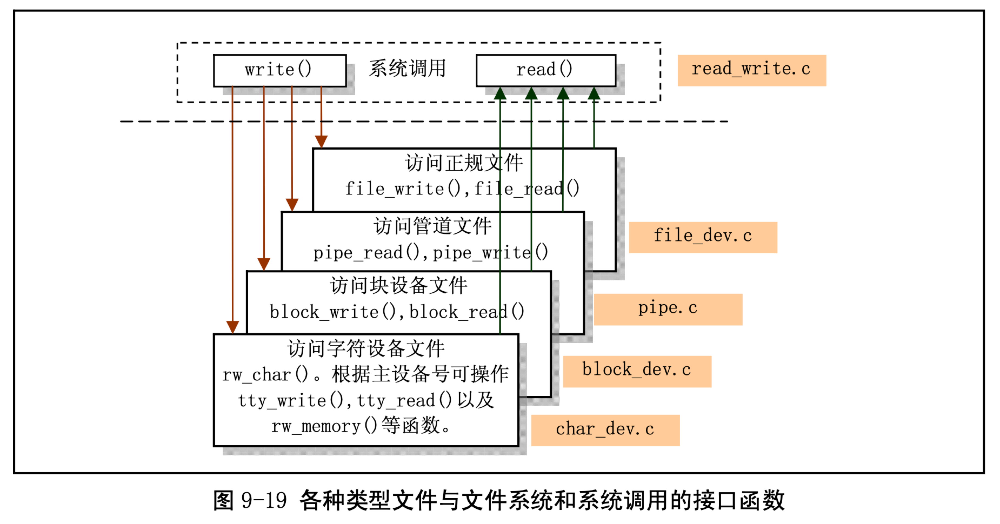
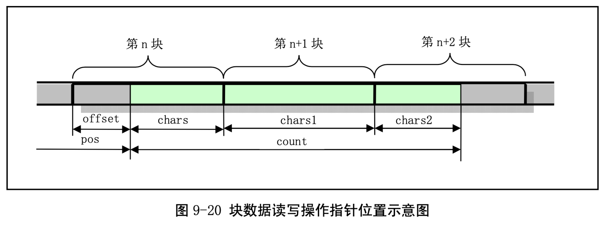

= block_dev.c

从这里开始的 4 个程序:block_dev.c、char_dev.c、pipe.c 和 file_dev.c 都是为随后的程序 read_write.c 服务的。read_write.c 程序主要实现了系统调用 write()和 read()。这 4 个程序可以看作是系统调用与块设 备、字符设备、管道“设备”和文件系统“设备”的接口驱动程序。它们之间的关系可以用图 9-19 表示。 系统调用 write()或 read()会根据参数所提供文件描述符的属性，判断出是哪种类型的文件，然后分别调 用相应设备接口程序中的读/写函数，而这些函数随后会执行相应的驱动程序。

== 功能描述

block_dev.c 程序属于块设备文件数据访问操作类程序。该文件包括 block_read()和 block_write()两个 块设备读写函数。这两个函数是供系统调用函数 read()和 write()调用的，其他地方没有引用。

由于块设备每次对磁盘读写是以盘块为单位的(与缓冲区中缓冲块长度相同)，因此函数 block_write() 首先把参数中文件指针 pos 位置映射成数据块号和块中偏移量值，然后使用块读取函数 bread()或块预读 函数 breada()将文件指针位置所在的数据块读入缓冲区的一个缓冲块中，然后根据本块中需要写的数据 长度 chars，从用户数据缓冲中将数据复制到当前缓冲块的偏移位置开始处。如果还有需要写的数据，则 再将下一块读入缓冲区的缓冲块中，并将用户数据复制到该缓冲块中，在第二次及以后写数据时，偏移 量 offset 均为 0。参见图 9-20 所示。

用户的缓冲区是用户程序在开始执行时由系统分配的，或者是在执行过程中动态申请的。用户缓冲 区使用的虚拟线性地址，在调用本函数之前，系统会将虚拟线性地址映射到主内存区中相应的内存页中。

函数 block_read()的操作方式与 block_write()相同，只是把数据从缓冲区复制到用户指定的地方。