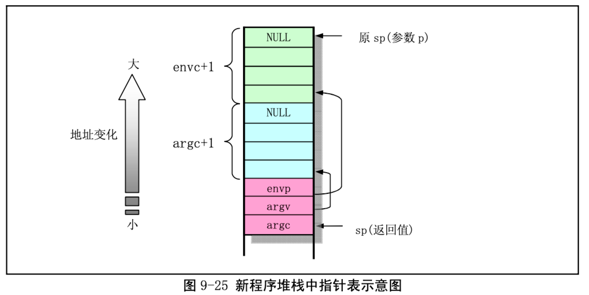

= exec.c

== 功能描述

本源程序实现对二进制可执行文件和 shell 脚本文件的加载与执行。其中主要的函数是函数 do_execve()，它是系统中断调用(int 0x80)功能号__NR_execve()调用的 C 处理函数，是 exec()函数簇的主要实现函数。其主要功能为:

• 执行对命令行参数和环境参数空间页面的初始化操作 -- 设置初始空间起始指针;初始化空间页面指针数组为(NULl);根据执行文件名取执行对象的 i 节点;计算参数个数和环境变量个数;检查文件类型，执行权限;
• 根据执行文件开始部分的头数据结构，对其中信息进行处理 -- 根据被执行文件 i 节点读取文件头部信息;若是 Shell 脚本程序(第一行以#!开始)，则分析 Shell 程序名及其参数，并以被执行文件作为参数执行该执行的 Shell 程序;执行根据文件的幻数以及段长度等信息判断是否可执行;
• 对当前调用进程进行运行新文件前初始化操作 -- 指向新执行文件的 i 节点;复位信号处理句柄; 根据头结构信息设置局部描述符基址和段长;设置参数和环境参数页面指针;修改进程各执行字段内容;
• 替换堆栈上原调用 execve()程序的返回地址为新执行程序运行地址，运行新加载的程序。

在 execve()执行过程中，系统会清掉 fork()复制的原程序的页目录和页表项，并释放对应页面。系统 仅为新加载的程序代码重新设置进程数据结构中的信息并设置执行代码执行点，而此时并不从块设备上 加载新程序的代码和数据。当该过程返回时即开始执行新的程序，但一开始执行肯定会引起缺页异常中 断发生。因为代码和数据还未被从块设备上读入内存。缺页异常处理过程会根据引起异常的线性地址在 主内存区为新程序中申请内存页面(内存帧)并从块设备上读入指定页面。同时还为该线性地址设置对 应的页目录项和页表项。

关于命令行参数和环境参数的含义解释如下。当用户在命令提示符下键入一个命令时，所指定执行 的程序会从该命令行上接受键入的命令行参数。例如当用户键入以下文件名列表命令时:
[source]
--
ls -l /home/john/
--
shell 进程会创建一个新进程并在其中执行/bin/ls 命令。在加载/bin/ls 执行文件时命令行上的三个参数 ls、 -l 和/home/john/将被新进程继承下来。在支持 C 的环境中，当调用程序的主函数 main()时它会带有两个参数。
[source]
--
int main(int argc, char *argv[])
--
第一个是执行程序时命令行上参数的个数值，通常记为argc(argument count)，第二个是指向包含字符 串参数的指针数组(argv -- argument vector)。每个字符串代表一个参数，并且 argv 数组的结尾总是以空 指针来结束。通常，argv[0]是被执行的程序名，因此 argc 的值至少是 1。对于上面的例子，此时 argc=3， argv[0]、argv[1]和 argv[2]分别是'ls'、'-l'和'/home/john/'。而 argv[3] = NULL。见图 9-23 所示。

main()还有第三个可选参数，该参数中包含环境变量
(environment variable)参数，用于定制执行程 序的环境设置并为其提供环境设置参数值。它也是一个指向包含字符串参数的指针数组，并以 NULL 结束，只是这些字符串是环境变量值。当程序需要明确用到环境变量时，main()的声明为:

[source]
----
int main(int argc, char *argv[], char *envp[])
----
环境字符串的形式为:

[source]
----
VAR_NAME=somevalue
----
其中 VAR_NAME 表示一个环境变量的名称，而等号后面的串代表给这个环境变量所赋的值。在命令行 提示符下键入 shell 内部命令 set 可以显示出当前环境中设置的环境参数列表。在程序开始执行前，命令行参数和环境字符串被放置在用户堆栈顶端的地方，见下面说明。

execve()函数有大量对命令行参数和环境空间的处理操作，参数和环境空间共可有 MAX_ARG_PAGES 个页面，总长度可达 128kB 字节。在该空间中存放数据的方式类似于堆栈操作，即是从假设的 128kB 空间末端处逆向开始存放参数或环境变量字符串的。在初始时，程序定义了一个指向 该空间末端(128kB-4 字节)处空间内偏移值 p，该偏移值随着存放数据的增多而后退，由图 9-24 中可以看 出，p 明确地指出了当前参数环境空间中还剩余多少可用空间。copy_string()函数用于从用户内存空间拷贝命令行参数和环境字符串到内核空闲页面中。在分析函数 copy_string()时，可参照此图。

create_tables()函数用于根据给定的当前堆栈指针值 p 以及参数变量个数值 argc 和环境变量个数 envc，在新的程序堆栈中创建环境和参数变量指针表，并返回此时的堆栈指针值 sp。创建完毕后堆栈指 针表的形式见下图 9-25 所示。

== 其他信息
=== a.out 执行文件格式
Linux 内核 0.11 版仅支持 a.out(Assembley & link editor output)执行文件格式，虽然这种格式目前已经
渐渐不用， 而使用功能更为齐全的 ELF(Executable and Link Format)格式，但是由于其简单性，作为学 习入门的材料正好比较适用。下面全面介绍一下 a.out 格式。

在头文件<a.out.h>中声明了三个数据结构以及一些宏函数。这些数据结构描述了系统上可执行的机 器码文件(二进制文件)。

一个执行文件共可有七个部分(七节)组成。按照顺序，这些部分是:

• 执行头部分(exec header)

    执行文件头部分。该部分中含有一些参数，内核使用这些参数将执行文件加载到内存中并执行，而链接程序(ld)使用这些参数将一些二进制目标文件组合成一个可执行文件。这是唯一必要的组成部分。

• 代码段部分(text segment)

    含有程序执行使被加载到内存中的指令代码和相关数据。可以以只读形式进行加载。

• 数据段部分(data segment)

    这部分含有已经初始化过的数据，总是被加载到可读写的内存中。

• 代码重定位部分(text relocations)

    这部分含有供链接程序使用的记录数据。在组合二进制目标文件时用于定位代码段中的指针或地址。 数据重定位部分(data relocations) 与代码重定位部分的作用类似，但是是用于数据段中指针的重定位。

• 符号表部分(simbol table)

    这部分同样含有供链接程序使用的记录数据，用于在二进制目标文件之间对命名的变量和函数(符 号)进行交叉引用。

• 字符串表部分(string table)

    该部分含有与符号名相对应的字符串。

每个二进制执行文件均以一个执行数据结构(exec structure)开始。该数据结构的形式如下:
[source]
--
struct exec {
             unsigned long a_midmag;
             unsigned long a_text;
             unsigned long a_data;
             unsigned long a_bss;
             unsigned long a_syms;
             unsigned long a_entry;
             unsigned long a_trsize;
             unsigned long a_drsize;
};
--
