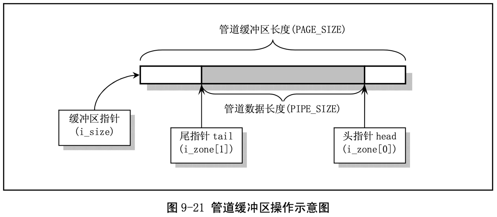

= pipe.c

== 功能描述

管道操作是进程间通信的最基本方式。本程序包括管道文件读写操作函数 read_pipe()和 write_pipe()， 同时实现了管道系统调用 sys_pipe()。这两个函数也是系统调用 read()和 write()的低层实现函数，也仅在 read_write.c 中使用。

在初始化管道时，管道 i 节点的 i_size 字段中被设置为指向管道缓冲区的指针，管道数据头部指针存放在 i_zone[0]字段中，而管道数据尾部指针存放在 i_zone[1]字段中。对于读管道操作，数据是从管道尾读出，并使管道尾指针前移读取字节数个位置;对于往管道中的写入操作，数据是向管道头部写入， 并使管道头指针前移写入字节数个位置。参见下面的管道示意图 9-21 所示。

read_pipe()用于读管道中的数据。若管道中没有数据，就唤醒写管道的进程，而自己则进入睡眠状 态。若读到了数据，就相应地调整管道头指针，并把数据传到用户缓冲区中。当把管道中所有的数据都 取走后，也要唤醒等待写管道的进程，并返回已读数据字节数。当管道写进程已退出管道操作时，函数就立刻退出，并返回已读的字节数。

write_pipe()函数的操作与读管道函数类似。

系统调用 sys_pipe()用于创建无名管道。它首先在系统的文件表中取得两个表项，然后在当前进程的文件描述符表中也同样寻找两个未使用的描述符表项，用来保存相应的文件结构指针。接着在系统中申请一个空闲 i 节点，同时获得管道使用的一个缓冲块。然后对相应的文件结构进行初始化，将一个文件结构设置为只读模式，另一个设置为只写模式。最后将两个文件描述符传给用户。