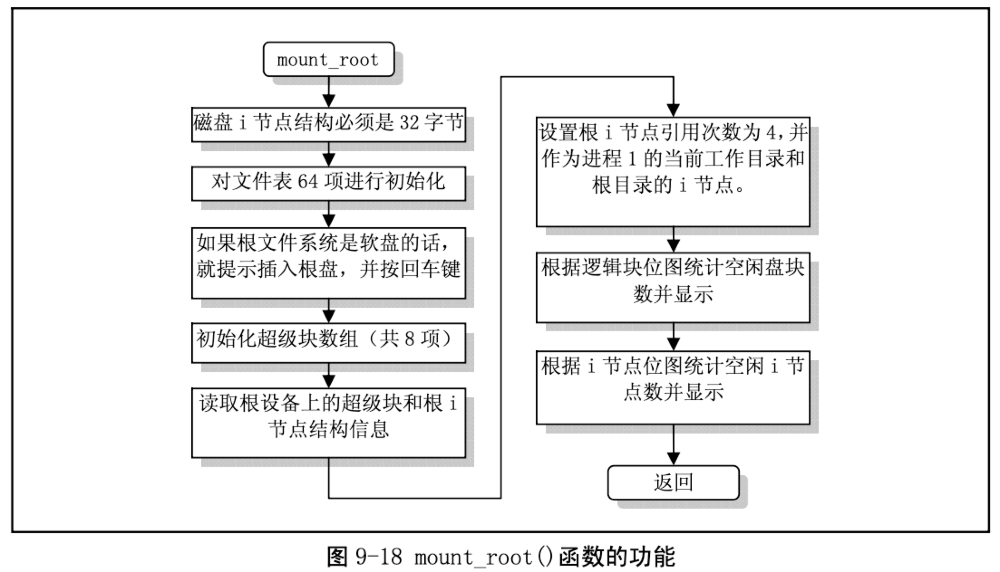

= super.c

== 功能描述

该文件描述了对文件系统中超级块操作的函数，这些函数属于文件系统低层函数，供上层的文件名和目录操作函数使用。主要有 get_super()、put_super()和 read_super()。另外还有 2 个有关文件系统加载/ 卸载系统调用 sys_umount()和 sys_mount()，以及根文件系统加载函数 mount_root()。其他一些辅助函数 与 buffer.c 中的辅助函数的作用类似。

超级块中主要存放了有关整个文件系统的信息，其信息结构参见“总体功能描述”中的图 9.x。

get_super()函数用于在指定设备的条件下，在内存超级块数组中搜索对应的超级块，并返回相应超 级块的指针。因此，在调用该函数时，该相应的文件系统必须已经被加载(mount)，或者起码该超级块 已经占用了超级块数组中的一项，否则返回 NULL。

put_super()用于释放指定设备的超级块。它把该超级块对应的文件系统的 i 节点位图和逻辑块位图所 占用的缓冲块都释放掉。在调用 umount()卸载一个文件系统或者更换磁盘时将会调用该函数。

read_super()用于把指定设备的文件系统的超级块读入到缓冲区中，并登记到超级块数组中，同时也 把文件系统的 i 节点位图和逻辑块位图读入内存超级块结构的相应数组中。最后并返回该超级块结构的 指针。

sys_umount()系统调用用于卸载一个指定设备文件名的文件系统，而 sys_mount()则用于往一个目录名上加载一个文件系统。

程序中最后一个函数 mount_root()是用于安装系统的根文件系统，并将在系统初始化时被调用。其具体操作流程图 9-18 所示。

该函数除了用于安装系统的根文件系统以外，还对内核使用文件系统起到初始化的作用。它对内存 中超级块数组进行了初始化，还对文件描述符数组表 file_table[]进行了初始化，并对根文件系统中的空 闲盘块数和空闲 i 节点数进行了统计并显示出来。

mount_root()函数是在系统执行初始化程序 main.c 中，在进程 0 创建了第一个子进程(进程 1)后被 调用的，而且系统仅在这里调用它一次。具体的调用位置是在初始化函数 init()的 setup()函数中。setup() 函数位于/kernel/blk_drv/hd.c 第 71 行开始。