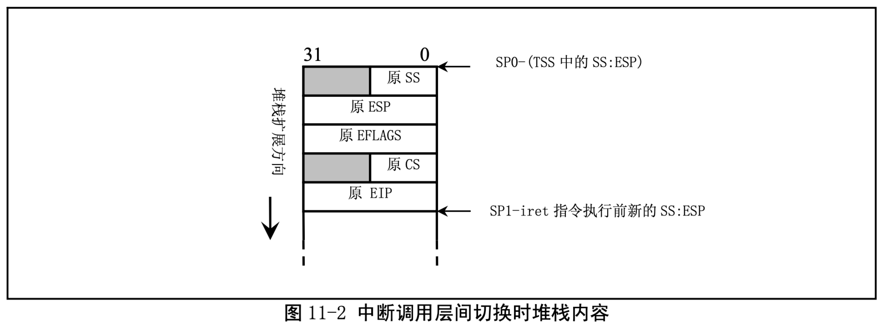
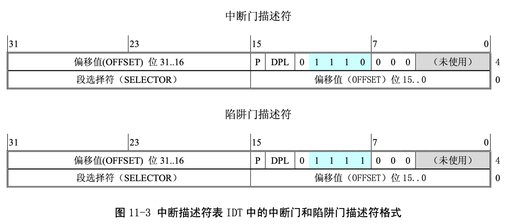

= system.h

== 功能描述

该文件中定义了设置或修改描述符/中断门等的嵌入式汇编宏。其中，函数 move_to_user_mode()是 用于内核在初始化结束时人工切换(移动)到初始进程(任务 0)去执行。所使用的方法是模拟中断调 用返回过程，即利用 iret 指令来实现特权级的变更和堆栈的切换，从而把 CPU 执行控制流移动到初始任 务 0 的环境中运行。见图 11-2 所示。

在去执行任务 0 代码之前，首先设置堆栈，模拟具有特权层切换的刚进入中断调用过程时堆栈的内容布 置情况。然后执行 iret 指令，从而引起系统移到任务 0 中去执行。在执行 iret 语句时，堆栈内容如图 11.2 中所示，此时 esp 为 esp1。任务 0 的堆栈就是内核的堆栈。当执行了 iret 之后，就移到了任务 0 中 执行了。由于任务 0 描述符特权级是 3，所以堆栈上的 ss:esp 也会被弹出。因此在 iret 之后，esp 又等于 esp0 了。注意，这里的中断返回指令 iret 并不会造成 CPU 去执行任务切换操作，因为在执行这个函数之 前，标志位 NT 已经在 sched_init()中被复位。在 NT 复位时执行 iret 指令不会造成 CPU 执行任务切换操 作。任务 0 的执行纯粹是人工启动的。

任务 0 是一个特殊进程，它的数据段和代码段直接映射到内核代码和数据空间，即从物理地址 0 开 始的 640K 内存空间，其堆栈地址即是内核代码所使用的堆栈。因此图中堆栈中的原 SS 和原 ESP 是将 现有内核堆栈指针直接压入堆栈的。

该文件中的另一部份给出了在中断描述符表 IDT 中设置不同类型描述符项的宏。_set_gate()是设置中断门描述符的宏 set_intr_gate()、set_system_gate()和设置陷阱门描述符的宏 set_trap_gate()所调用的通用宏。IDT 表中的中断门(Interrupt Gate)和陷阱门(Trap Gate)描述符项的格式见图 11-3 所示。

其中，P 是段存在标志;DPL 是描述符的优先级。中断门与陷阱门的区别在于对 EFLAGS 的中断允许标 志 IF 的影响。由中断门描述符执行的中断会复位 IF 标志，因此可以避免其它中断干扰当前中断的处理。 随后的中断结束指令 IRET 会从堆栈上恢复 IF 标志的原值;而通过陷阱门执行的中断则不会影响 IF 标志。

在设置描述符的通用宏_set_gate(gate_addr,type,dpl,addr)中，参数 gate_addr 指定了描述符所处的物理 内存地址。type 指明所需设置的描述符类型，它对应图 11-3 中描述符格式中第 6 字节的低 4 比特位，因 此 type=14(0x0E)指明是中断门描述符，type=15(0x0F)指明是陷阱门描述符。参数 dpl 即对应描述 符格式中的 DPL。addr 是描述符对应的中断处理过程的 32 位偏移地址。因为中断处理过程属于内核段 代码，所以它们的段选择符值均为 0x0008(在 eax 寄存器高字中指定)。

system.h 文件的最后一部份是用于设置一般段描述符内容和在全局描述符表 GDT 中设置任务状态段 描述符以及局部表段描述符的宏。这几个宏的参数含义与上述类似。