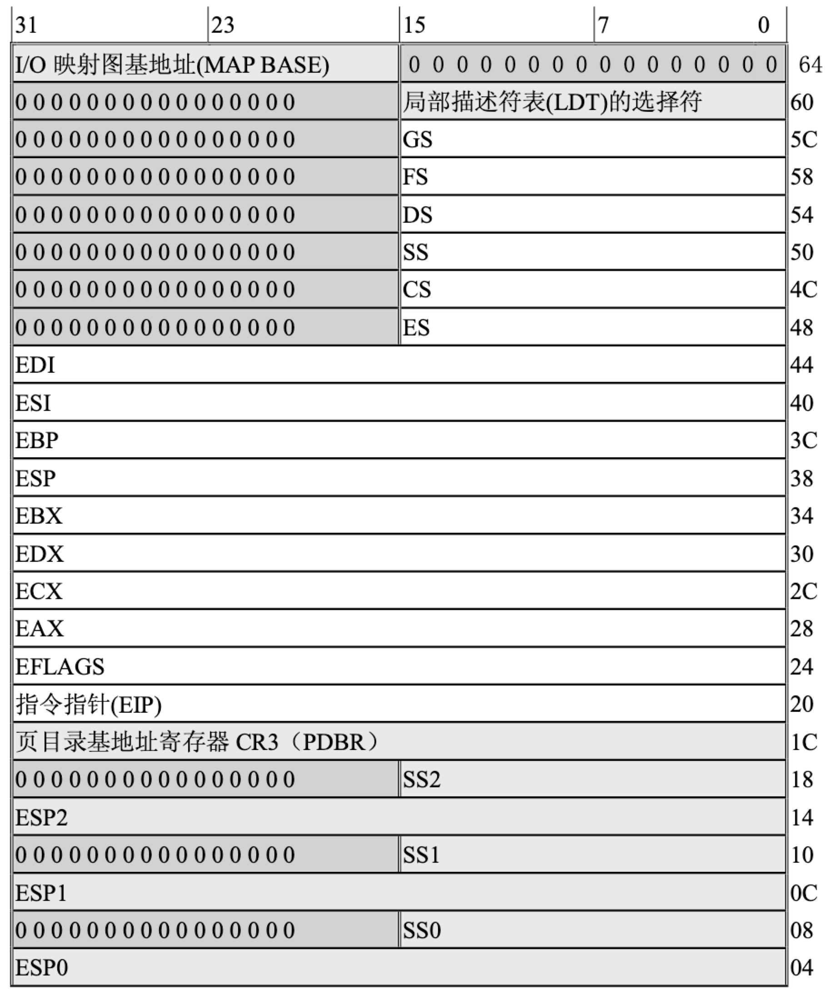
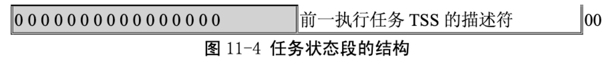

= sched.h

== 功能描述

调度程序头文件，定义了任务结构 task_struct、初始任务 0 的数据，还有一些有关描述符参数设置 和获取的嵌入式汇编函数宏语句。

== 其他信息

=== 任务状态段信息（TSS）

任务状态段的详细说明请参考附录。这里对其进行简单描述。

CPU 管理任务需要的所有信息被存储于一个特殊类型的段中，任务状态段(task state segment - TSS)。 图中显示出执行 80386 任务的 TSS 格式。

TSS 中的字段可以分为两类:

1. CPU 在进行任务切换时更新的动态信息集。这些字段有:

* 通用寄存器(EAX，ECX，EDX，EBX，ESP，EBP，ESI，EDI);
* 段寄存器(ES, CS, SS, DS, FS, GS);
* 标志寄存器(EFLAGS);
* 指令指针(EIP);
* 前一个执行任务的 TSS 的选择符(仅当返回时才更新)。

2. CPU 读取但不会更改的静态信息集。这些字段有:
* 任务的 LDT 的选择符;
* 含有任务页目录基地址的寄存器(PDBR);
* 特权级 0-2 的堆栈指针;
* 当任务进行切换时导致 CPU 产生一个调试(debug)异常的 T-比特位(调试跟踪位);
* I/O 比特位图基地址(其长度上限就是 TSS 的长度上限，在 TSS 描述符中说明)。

任务状态段可以存放在线形空间的任何地方。与其他各类段相似，任务状态段也是由描述符来定义 的。当前正在执行任务的 TSS 是由任务寄存器(TR)来指示的。指令 LTR 和 STR 用来修改和读取任务 寄存器中的选择符(任务寄存器的可见部分)。

I/O 比特位图中的每 1 比特对应 1 个 I/O 端口。比如端口 41 的比特位就是 I/O 位图基地址+5，位偏 移 1 处。在保护模式中，当遇到 1 个 I/O 指令时(IN, INS, OUT, OUTS)，CPU 首先就会检查当前特权级是 否小于标志寄存器的 IOPL，如果这个条件满足，就执行该 I/O 操作。如果不满足，那么 CPU 就会检查 TSS 中的 I/O 比特位图。如果相应比特位是置位的，就会产生一般保护性异常，否则就会执行该 I/O 操 作。