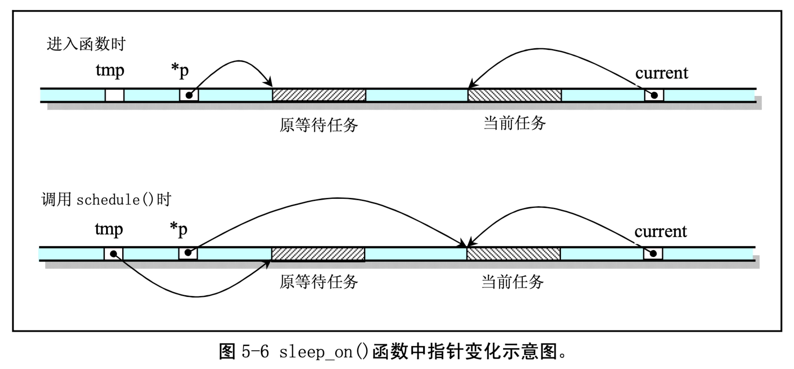
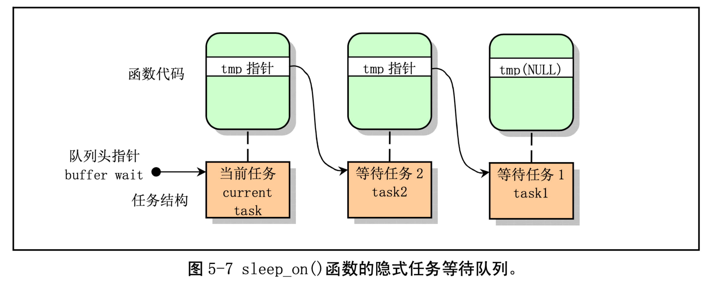

= sched.c

== 功能描述

sched.c 是内核中有关任务调度管理的程序，其中包括有关调度的基本函数(sleep_on()、wakeup()、 schedule()等)以及一些简单的系统调用函数(比如 getpid())。系统时钟中断处理过程中调用的定时函数 do_timer()也被放置在本程序中。另外，为了便于软盘驱动器定时处理的编程，Linus 也将有关软盘定时 操作的几个函数放到了这里。

这几个基本函数的代码虽然不长，但有些抽象，比较难以理解。好在市面上有许多教科书对此解释 得都很清楚，因此可以参考其他书籍对这些函数的讨论。这些也就是教科书上重点讲述的对象，否则理论书籍也就没有什么好讲的了☺。这里仅对调度函数 schedule()作一些详细说明。

schedule()函数首先对所有任务(进程)进行检测，唤醒任何一个已经得到信号的任务。具体方法是针对任务数组中的每个任务，检查其报警定时值 alarm。如果任务的 alarm 时间已经过期(alarm<jiffies), 则在它的信号位图中设置 SIGALRM 信号，然后清 alarm 值。jiffies 是系统从开机开始算起的滴答数(10ms/ 滴答)。在 sched.h 中定义。如果进程的信号位图中除去被阻塞的信号外还有其他信号，并且任务处于可中断睡眠状态(TASK_INTERRUPTIBLE)，则置任务为就绪状态(TASK_RUNNING)。

随后是调度函数的核心处理部分。这部分代码根据进程的时间片和优先权调度机制，来选择随后要 执行的任务。它首先循环检查任务数组中的所有任务，根据每个就绪态任务剩余执行时间的值 counter， 选取该值最大的一个任务，并利用 switch_to()函数切换到该任务。若所有就绪态任务的该值都等于零， 表示此刻所有任务的时间片都已经运行完，于是就根据任务的优先权值 priority，重置每个任务的运行时间片值 counter，再重新执行循环检查所有任务的执行时间片值。

另两个值得一提的函数是自动进入睡眠函数 sleep_on()和唤醒函数 wake_up()，这两个函数虽然很短， 却要比 schedule()函数难理解。这里用图示的方法加以解释。简单地说，sleep_on()函数的主要功能是当 一个进程(或任务)所请求的资源正忙或不在内存中时暂时切换出去，放在等待队列中等待一段时间。 当切换回来后再继续运行。放入等待队列的方式是利用了函数中的 tmp 指针作为各个正在等待任务的联系。

函数中共牵涉到对三个任务指针操作:*p、tmp 和 current，*p 是等待队列头指针，如文件系统内存 i 节点的 i_wait 指针、内存缓冲操作中的 buffer_wait 指针等;tmp 是临时指针;current 是当前任务指针。 对于这些指针在内存中的变化情况我们可以用图 5-6 的示意图说明。图中的长条表示内存字节序列。

当刚进入该函数时，队列头指针*p 指向已经在等待队列中等待的任务结构(进程描述符)。当然， 在系统刚开始执行时，等待队列上无等待任务。因此上图中原等待任务在刚开始时是不存在的，此时*p 指向 NULL。通过指针操作，在调用调度程序之前，队列头指针指向了当前任务结构，而函数中的临时 指针 tmp 指向了原等待任务。从而通过该临时指针的作用，在几个进程为等待同一资源而多次调用该函 数时，程序就隐式地构筑出一个等待队列。从图 5-7 中我们可以更容易地理解 sleep_on()函数的等待队列 形成过程。图中示出了当向队列头部插入第三个任务时的情况。

在插入等待队列后，sleep_on()函数就会调用 schedule()函数去执行别的进程。当进程被唤醒而重新 执行时就会执行后续的语句，把比它早进入等待队列的一个进程唤醒。

唤醒操作函数 wake_up()把正在等待可用资源的指定任务置为就绪状态。该函数是一个通用唤醒函 数。在有些情况下，例如读取磁盘上的数据块，由于等待队列中的任何一个任务都可能被先唤醒，因此 还需要把被唤醒任务结构的指针置空。这样，在其后进入睡眠的进程被唤醒而又重新执行 sleep_on()时， 就无需唤醒该进程了。

还有一个函数 interruptible_sleep_on()，它的结构与 sleep_on()的基本类似，只是在进行调度之前是把当前任务置成了可中断等待状态，并在本任务被唤醒后还需要判断队列上是否有后来的等待任务，若有， 则调度它们先运行。在内核 0.12 开始，这两个函数被合二为一，仅用任务的状态作为参数来区分这两种 情况。

在阅读本文件的代码时，最好同时参考包含文件 include/kernel/sched.h 文件中的注释，以便更清晰地了解内核的调度机理。